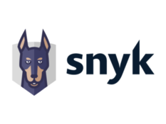

# Frontispiece

## About the Standard

The Large Language Model Security Verification Standard is a list of specific AI and LLM security requirements or tests that can be used by architects, developers, testers, security professionals, tool vendors, and consumers to define, build, test and verify secure LLM driven applications.

## Copyright and License

Version 0.0.1 (Bleeding Edge version), 2024

Copyright © 2008-2024 The OWASP Foundation. This document is released under the [Creative Commons Attribution-ShareAlike 4.0 International License](https://creativecommons.org/licenses/by-sa/4.0/). For any reuse or distribution, you must make clear to others the license terms of this work.

## Project Leads

|                       |                  |             |
|---------------------- |----------------- |------------ |
| Vandana Sehgal | Elliot Ward  |   |

## Other Contributors and Reviewers

|                 |                   |                      |                     |                      |
|---------------- |------------------ |--------------------- |-------------------- |--------------------- |
| Eric Allen (Lakera)    | Frawa Vetterli (Lakera)     | Rory McNamara (Snyk)    | Raul Onitza-Klugman (Snyk)  |Moshe Ben-Nehemia (Snyk)|
| Sam Watts (Lakera) | | | | |

If a credit is missing from the 0.0.1 credit list above, please log a ticket at GitHub to be recognized in future 0.x updates.

The Large Language Model Security Verification Standard is built upon the initial research performed into LLM security by the Snyk Security labs team in 2023. Much of the concept, structure, boilerplate and tooling for the LLMSVS has been adapted from the OWASP ASVS project. Thank you to all those previously involved in the OWASP ASVS.

## Major Supporters and Sponsors
This initiative would not have been possible without the support of our sponsors and the resources they have provided. We would like to express our gratitude to the following for their support.

### Snyk

The LLMSVS project was founded as a way to share some of the knowledge gained from research into AI and LLM projects within the Snyk Security Labs team. We thank Snyk for the effort into eliciting the initial requirements and founding the project.

### Lakera

Lakera, a security company that empowers developers to confidently build secure Generative AI applications, reviewed and proofread an early draft of this standard, providing guidance based on their expertise with model lifecycle security and secure LLM integration.
